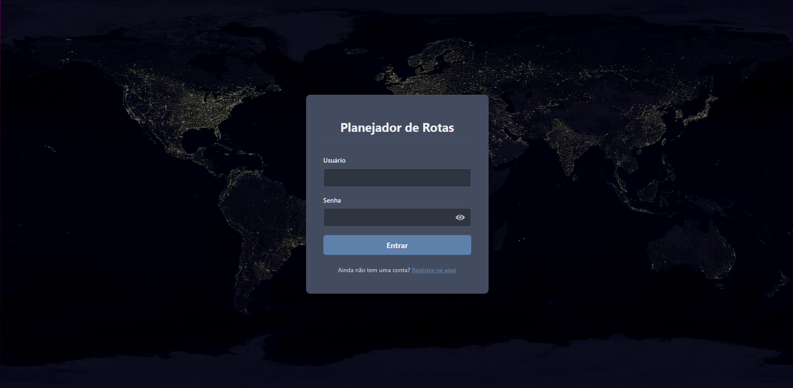
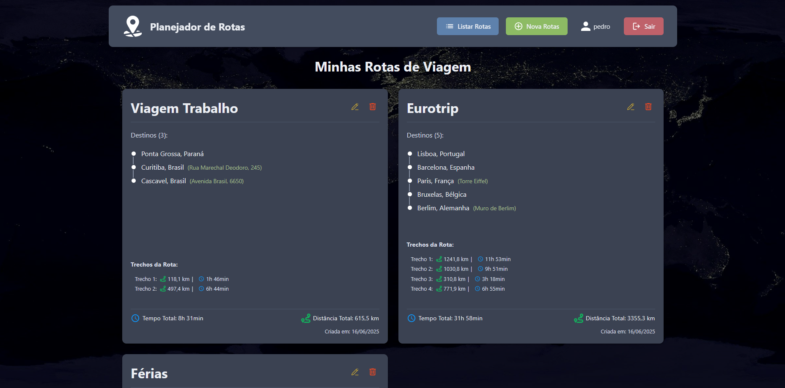
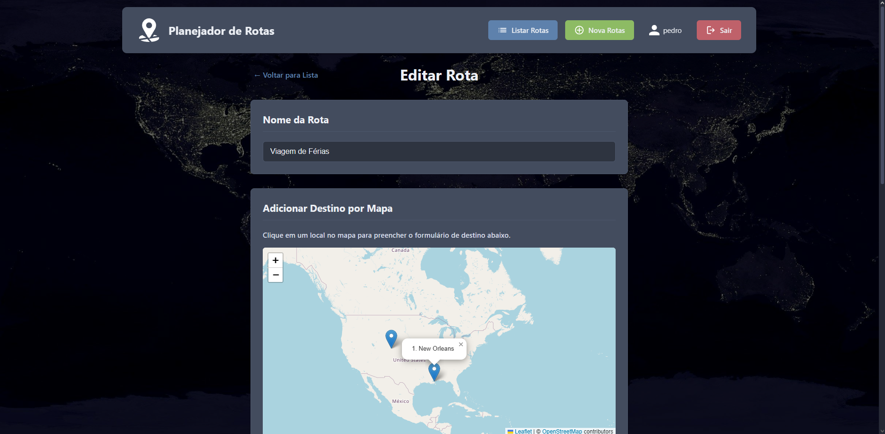
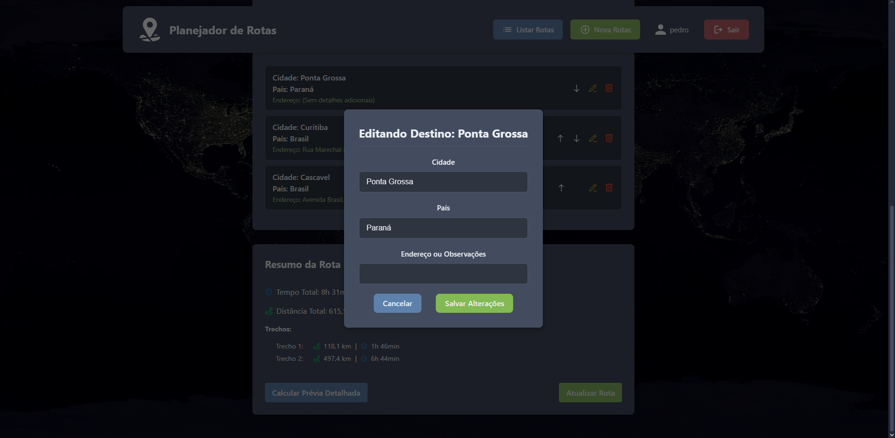
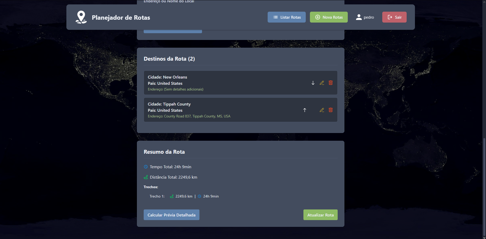

#  🗺️ Seu Planejador de Rotas de Viagem Inteligente 

Bem-vindo ao seu planejador de rotas, uma aplicação web completa desenvolvida para te ajudar a planejar suas viagens de forma eficiente e organizada. Crie rotas, adicione destinos, visualize distâncias, tempos de percurso e muito mais!

Este projeto foi construído como parte de um desafio técnico, demonstrando habilidades em desenvolvimento full-stack com Node.js, React, e integração de serviços externos, além de estar totalmente configurado para rodar com Docker.

---

## 🌟 Funcionalidades Principais

* **Ambiente Dockerizado:**
    * Configuração completa com `Docker` e `Docker Compose`, permitindo que toda a aplicação (backend e frontend) seja iniciada com um único comando.
    * Garante um ambiente de desenvolvimento consistente e simplifica o deploy.
* **Autenticação de Usuários:**
    * Sistema de registro seguro com validação e criptografia de senhas (`bcryptjs`).
    * Login com gerenciamento de sessão via **JSON Web Tokens (JWT)**.
    * API com rotas protegidas, garantindo que cada usuário acesse apenas suas próprias informações.
* **Rotas de Viagem Personalizadas:**
    * Criação, listagem, edição e exclusão (CRUD completo) de rotas de viagem, associadas individualmente a cada usuário.
    * Interface intuitiva para nomear e gerenciar múltiplas rotas.
* **Gerenciamento Detalhado de Destinos:**
    * Adição de múltiplos destinos a cada rota, especificando cidade, país e observações/endereço.
    * **Geocodificação Automática:** Ao adicionar um destino com informações textuais, o sistema busca automaticamente suas coordenadas (latitude e longitude) usando a API do OpenRouteService.
    * **Reordenação de Destinos:** Interface permite que o usuário reorganize a ordem dos destinos dentro de uma rota de forma fácil.
    * Exclusão e edição de destinos de uma rota.
* **Cálculo e Visualização de Percurso (Integrado com OpenRouteService):**
    * Ao salvar ou atualizar uma rota com pelo menos dois destinos, o sistema calcula automaticamente:
        * A **distância total** e o **tempo total estimado** da viagem.
        * A **distância e tempo de cada trecho individual** entre os destinos.
    * Esses dados precisos são armazenados e exibidos para o usuário.
    * Botão "Calcular Prévia Detalhada" nas telas de criação/edição para obter uma estimativa atualizada antes de salvar.
* **Interface Moderna e Reativa:**
    * Frontend construído com React e Vite, utilizando componentes reutilizáveis.
    * Navegação fluida entre páginas com React Router DOM.
    * Estilização com CSS Modules para componentes escopados e organizados.
    * Uso de modais customizados para alertas e confirmações, melhorando a experiência do usuário.
    * Header responsivo.
* **Backend Robusto:**
    * API RESTful construída com Node.js e Express.js.
    * Persistência de dados com NeDB (banco de dados leve baseado em arquivos).
    * Tratamento de erros padronizado e informativo.
    * Uso de variáveis de ambiente para configuração segura de chaves de API e segredos JWT.
      
---

## 🛠️ Tecnologias Utilizadas

<p align="center">
  
  
  
  
  
  
  
  
</p>

**Backend:**
* Node.js
* Express.js
* NeDB (Banco de dados NoSQL em arquivo)
* `bcryptjs` (Para hashing de senhas)
* `jsonwebtoken` (Para autenticação baseada em tokens JWT)
* `dotenv` (Para gerenciamento de variáveis de ambiente)
* API Externa: OpenRouteService (para Geocodificação e Direções/Cálculo de Rotas)

**Frontend:**
* React (com Hooks)
* Vite (Build tool e servidor de desenvolvimento)
* React Router DOM (Para roteamento no lado do cliente)
* CSS Modules (Para estilização escopada)
* `fetch` API (Para comunicação com o backend)

**Ferramentas de Desenvolvimento:**
* Docker (Containerização)
* Postman (Para testes da API)
* Git & GitHub (Para versionamento de código)

---

## 🖼️ Interfaces

### Tela de Autenticação



### Dashboard Principal (Listagem de Rotas)



### Criação e Edição de Rotas





---

## 🚀 Como Rodar o Projeto Localmente

Siga os passos abaixo para configurar e rodar o projeto na sua máquina.

**Pré-requisitos:**
* Docker e Docker Compose instalados.

**Passos:**
1.  Clone o repositório:
    ```bash
    git clone https://github.com/pedro-ft/planejador-rotas.git
    cd planejador-rotas
    ```
2.  Configure as Variáveis de Ambiente do Backend:
    * Navegue até a pasta `backend`.
    * Crie um novo arquivo `.env`.
    * Preencha as variáveis necessárias trocando para seus valores:
      ```env
      # backend/.env
      ORS_API_KEY=SUA_CHAVE_API_REAL_DO_OPENROUTESERVICE
      JWT_SECRET=SEU_SEGREDO_JWT_FORTE_E_ALEATORIO
      ```
3.  Inicie a aplicação com Docker Compose:
    * Na **raiz do projeto** (onde está o arquivo `docker-compose.yml`), execute:
      ```bash
      docker-compose up --build
      ```
4.  Pronto!
    * O frontend estará acessível em `http://localhost:5173`.
    * O backend estará rodando em `http://localhost:4000`.

---

## 🏗️ Estrutura do Projeto (Visão Geral)

O projeto está dividido em duas pastas principais:

* **`/backend`**: Contém toda a lógica da API Node.js/Express, incluindo:
    * `database/`: Configuração e arquivos de dados do NeDB.
    * `routes/`: Definição dos endpoints da API.
    * `controllers/`: Lógica para manipular requisições e respostas HTTP.
    * `services/`: Lógica de negócio e interações com o banco de dados e APIs externas.
    * `middleware/`: Middlewares customizados (ex: autenticação).
    * `index.js`: Ponto de entrada do servidor backend.
* **`/frontend`**: Contém a aplicação React (criada com Vite), incluindo:
    * `src/components/`: Componentes React reutilizáveis (Header, Modais, Cards, etc.).
    * `src/pages/`: Componentes que representam as diferentes páginas da aplicação (Login, Listar Rotas, Nova Rota, etc.).
    * `src/context/`: Contextos React (ex: AuthContext).
    * `src/services/`: Módulos para interagir com a API backend (ex: apiClient.js).
    * `src/utils/`: Funções utilitárias.
    * `src/assets/`: Ícones e outros assets estáticos.
    * `App.jsx`: Componente raiz que define o layout e as rotas principais.
    * `main.jsx`: Ponto de entrada da aplicação React.

---

## 🔮 Possíveis Melhorias e Funcionalidades Futuras

Aqui estão algumas ideias para evoluções futuras:
* **Reordenação Drag-and-Drop:** Tornar a reordenação de destinos mais interativa com arrastar e soltar.
* **Deploy:** Publicar a aplicação em uma plataforma de hospedagem.
